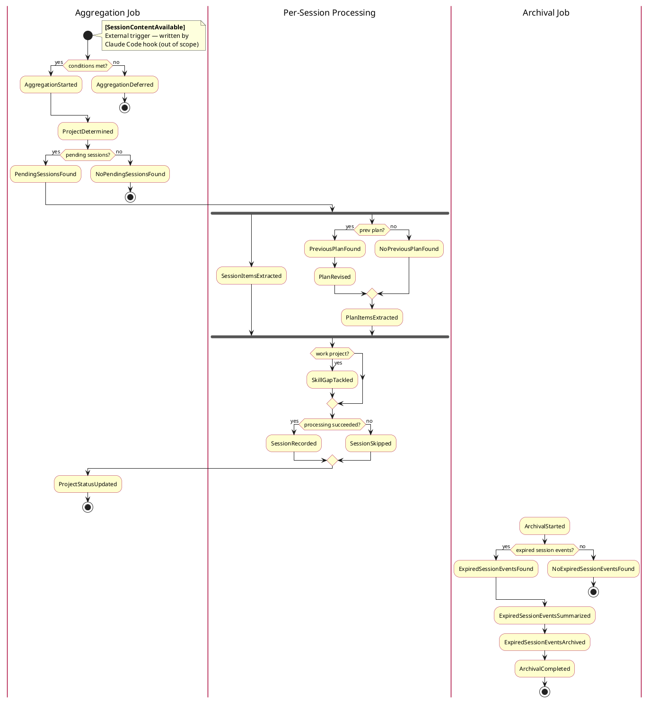

# Claude Conversation Sync to Knowledge Base

## Goal

Make Claude useful across sessions by giving it awareness of previous work on a project —
what was decided, what's in flight, what was learned — without requiring manual context
sharing. Conversations are an untapped source of project memory and career evidence.

## Context

Claude Code stores conversations in `~/.claude/projects/` as `.jsonl` files under opaque
directory names (e.g., `-Users-roman-gonzalez-Documents-PARA`) with UUID filenames. This makes
conversations hard to find, disconnected from the knowledge base, and at risk of content loss
when compaction rewrites files in-place. This module syncs conversations to a configurable
output directory with human-readable organization, maintains a living project status document,
and injects relevant context at session start.

---

## Domain Model

### Ubiquitous Language

#### Session
A conversation with Claude Code. Tied to a Project, identified by an opaque ID assigned by
Claude Code. Never explicitly ends — it is abandoned when the user stops continuing it. May
grow over time via `claude --continue`, which appends new messages under the same identity.

#### Project
The unit of work a Session belongs to. Always backed by a git repository. Has two first-class
identifiers:
- **Key** — canonical, opaque, derived from git remote URL + subpath. Stable across clones.
  Used for identity.
- **Name** — human-readable, first-class. Used everywhere a human reads output.

Has a **Context**: work or personal. Derived from config (`workRemotes`). Determines what
processing a Session receives.

#### Availability Signal
A file written by the Capture hook when a Session has new unprocessed content. Carries the
Session identity and a timestamp. The timestamp distinguishes a fresh exit from a `--continue`
resumption of the same Session. Watched by the aggregation job, which waits for a **Quiet
Period** before processing.

#### Quiet Period
A configurable window during which no new Availability Signals arrive. The aggregation job
only processes when the newest signal is older than the threshold. Separates "user stepped
away momentarily" from "user has moved on."

#### SessionEvent
A single meaningful observation extracted from a Session. Has:
- **Tag** — a validated text label from a fixed vocabulary; classifies the observation for
  LLMs and search; no program logic branches on it
- **Text** — the observation stated in plain language
- **Source** — where it came from: the conversation, a plan diff, or a newly created plan

On disk: one line in `EVENTS.jsonl`, self-contained with Session identity, Project, and date
baked in. In memory: a component of a `SessionReport`.

#### SessionReport
The in-memory aggregate produced by the aggregation job when processing a Session. Groups all
SessionEvents for one Session. A processing-time concept — never serialised to disk as a
whole. Written to `EVENTS.jsonl` by flattening its SessionEvents into individual lines.

#### Skill Gap
A known area for improvement identified through a peer review. Always in a work context.
Vocabulary owned entirely by the external `self-review-signal` reference — this system never
defines gaps. Attaching a Skill Gap to a SessionEvent claims **demonstrated evidence of
working on that gap** — observable, not evaluative.

#### Project Status
A human-readable synthesis of where a Project stands. Produced by the aggregation job after
each processing run. Answers: where are we, where are we going, what do we know, what do we
need to know. Derived from the full project history — recent SessionEvents plus Archive Entry
summaries for older periods. Stored as `STATUS.md`. Rebuilt from scratch on every run —
always a fresh synthesis, not an accumulation.

#### Archival
The process of moving old SessionEvents out of `EVENTS.jsonl` into a separate archive file
to keep the main log manageable. Runs on a monthly schedule. Distinct from Claude Code's own
compaction (which rewrites session transcript files). Produces an **Archive Entry** and an
**Archive File**.

#### Archive Entry
The pointer left in `EVENTS.jsonl` after an Archival run. Contains the date range of the
archived period, a path to the Archive File, and an LLM-generated prose summary of that
period. Read by the status synthesis LLM and by `--deep` retrieval.

#### Archive File
The file containing the raw SessionEvents moved out during Archival. Stored at
`archive/EVENTS-YYYY-MM.jsonl`. Never deleted — only moved. Searchable via `--deep`.

---

### Bounded Contexts

Three bounded contexts, communicating exclusively via the filesystem. Each evolves
independently as long as file format contracts are honoured.

```
Capture ──(availability signals + JSONL snapshots)──► Processing ──(EVENTS.jsonl + STATUS.md)──► Retrieval
```

#### Capture
Fast, synchronous, no LLM calls. Triggered by Claude Code lifecycle hooks.
- **Language**: session, transcript, plan, availability signal
- **Responsibility**: preserve raw session artifacts faithfully when a Session exits
- **Produces**: `{session-id}.jsonl`, `{session-id}-{timestamp}.available`
- **Rule**: stays cheap — copy files, write signals, nothing more

#### Processing
Async, intelligent, owns the aggregates. Triggered by availability signals + quiet period.
- **Language**: project, session event, session report, project status, skill gap
- **Responsibility**: derive meaning from raw artifacts; maintain the knowledge base
- **Contains**: Aggregation Job + Archival Job (same language, same aggregates)
- **Consumes**: availability signals + JSONL snapshots from Capture
- **Produces**: `EVENTS.jsonl`, `STATUS.md`

#### Retrieval
Read-only, surfacing. Triggered by session start hook or `/context` command.
- **Language**: context, status, history
- **Responsibility**: surface relevant project knowledge to Claude at the right moment
- **Consumes**: `EVENTS.jsonl` + `STATUS.md` from Processing

#### Context Map
- Capture is **upstream** of Processing — format changes in Capture can break Processing
- Processing owns an ACL (parser) at its Capture boundary — absorbs format changes there
- Archival Job lives inside Processing: same aggregates, same language, different schedule

---

### Event Storm

Domain events derived through an event storming session. Events are named at the domain
level — implementation details (file locks, watchers, temp files, I/O verbs) are absent.
Capture is a separate bounded context; `SessionContentAvailable` is shown as an external
trigger at the Processing boundary.

**Jobs:** `Aggregation Job` | `Per-Session Processing` | `Archival Job`



> File: `/tmp/conversation-sync-event-storm.puml`

---

## System Design

### Capture

| Hook | Action |
|------|--------|
| `PreCompact` | Copy current `.jsonl` as `{id}-precompact-{timestamp}.jsonl` |
| `SessionEnd` | Copy final `.jsonl` + sub-agent `.jsonl` files + plan files modified during session, write `{id}-{timestamp}.available` signal |

Both hooks read JSON from stdin (includes `transcript_path`, `session_id`).
**Hooks stay dirt cheap**: copy files, write signal. No LLM calls. Milliseconds.

Sub-agent transcripts are folded into the parent session — they are implementation detail,
not independent work units.

`SessionEnd` also scans `~/.claude/plans/` for files modified after session start and copies
them into a `plans/` subdirectory.

---

### Processing

#### Aggregation Job

**Trigger: Quiet-Period (not immediate)**

The job fires when `.available` signals appear but only processes when files have been
**quiet for 15-30 minutes** (newest `.available` file older than threshold). This decouples
summarization from session close — no WTF moments, no token drain on active sessions.

Multiple sessions ending close together are batched into one pass naturally.

**Concurrency Safety**

- **Lock file**: job acquires `{outputPath}/{project}/.lock` before writing; bails if locked
- **Idempotency**: tracks processed signals by (session ID, timestamp); never processes the
  same content twice
- **Single STATUS.md rewrite**: done once at end of the job after all pending sessions
  processed

**What the Job Produces**

For each unprocessed `.available` signal:

1. Calls `claude -p` with the **session extraction prompt** → appends SessionEvents to
   `EVENTS.jsonl`
2. If plans were copied this session: diffs each plan against its previous session copy,
   appends `plan-created` or `plan-updated` SessionEvents (see Plans section below)
3. For work projects: runs **second pass** with the **skill gap tagging prompt** → enriches
   SessionEvents with `skill_gap` field
4. After all pending sessions: rewrites `STATUS.md` using the **status synthesis prompt**

**Plans**

Plan files copied during a session are diffed against the most recent previous copy of the
same filename across all prior sessions. Three cases:

- **Plan created** (no previous copy): SessionEvents tagged `plan-created`; extracted
  decisions tagged `plan-new`
- **Plan updated** (previous copy found): SessionEvents tagged `plan-updated`; semantic
  changes extracted as `plan-diff` SessionEvents
- **Plan touched but unchanged**: skip, no SessionEvents written

> The diff prompt must filter out purely structural changes (reformatting, reordering)
> and only surface semantic changes. This is a prompt quality concern.

**Skill Gap Tagging (work projects only)**

After session extraction, a second `claude -p` pass runs with the `self-review-signal`
reference. It enriches matching SessionEvents with a `skill_gap` field. Tags come
exclusively from the external reference — the job never invents gap labels.

The `self-review-signal` weekly summary skill consumes `EVENTS.jsonl` as a source.
See `~/Documents/PARA/.claude/skills/self-review-signal/SKILL.md` for the full taxonomy.

---

#### Archival Job

Monthly, a separate scheduled async job moves old SessionEvents to per-month Archive Files,
leaving an Archive Entry pointer in the main log.

---

### Project Identification

Canonical project identity hierarchy:

1. **`.claude-project` file** in CWD — explicit override
2. **Git remote + relative path from git root** — handles monorepos and multi-clone
3. **Last directory component** — fallback for non-git projects

```
# Monorepo:
remote: git@git.musta.ch:airbnb/kube-system.git
cwd: .../kube-system/workload-controller
→ project_key: git.musta.ch/airbnb/kube-system/workload-controller

# Same project, two clones:
/Projects/work/ergo + /tmp/ergo-clean → same remote → same project_key
```

SSH/HTTPS variants normalised to the same key.

**Work Classification**

```nix
workRemotes = [ "git.musta.ch" ];
```

Work projects get: skill gap tagging, Growth Signals section in STATUS.md,
`self-review-signal` context at injection time.

---

### Retrieval

**Injection (session start)**

`UserPromptSubmit` hook detects STATUS.md, surfaces offer with metadata:
> *"Found context for `workload-controller` — STATUS.md + 7 EVENTS entries, last updated
> 2 days ago. Load all, status only, or skip?"*

Nothing loads silently. User confirms every time.

**Fallback**: `/context` slash command
```
/context                    # STATUS.md + last 3-5 sessions
/context --last 10
/context --since 2026-01
/context --tag decision
/context --deep             # also search archive files
```

**Retrieval Strategy**

Ripgrep against `EVENTS.jsonl` with Claude as the semantic layer — no embeddings.

Two-tier proactive model:
- **Free**: connecting dots within already-loaded STATUS.md + N EVENTS (in context)
- **Permissioned**: deeper history — Claude offers, user confirms before searching

---

## Data Formats

### EVENTS.jsonl

Append-only. One JSON object per SessionEvent. Never edited after writing.

```json
{"date":"2026-02-27","session":"abc123","project":"ergo","project_key":"git.musta.ch/airbnb/ergo","project_path":"/Users/roman/Projects/work/ergo","tag":"decision","text":"use launchd over systemd for macOS watcher","source":"conversation"}
{"date":"2026-02-27","session":"abc123","project":"ergo","project_key":"git.musta.ch/airbnb/ergo","project_path":"/Users/roman/Projects/work/ergo","tag":"resolved","text":"home-manager WatchPaths natively supported","source":"conversation"}
{"date":"2026-02-27","session":"abc123","project":"ergo","project_key":"git.musta.ch/airbnb/ergo","project_path":"/Users/roman/Projects/work/ergo","tag":"question","text":"how are sub-agent transcripts named?","source":"conversation"}
{"date":"2026-02-27","session":"abc123","project":"ergo","project_key":"git.musta.ch/airbnb/ergo","project_path":"/Users/roman/Projects/work/ergo","tag":"next","text":"wire up SessionEnd hook to copy plans/ directory","source":"plan-diff"}
{"date":"2026-02-27","session":"abc123","project":"ergo","project_key":"git.musta.ch/airbnb/ergo","project_path":"/Users/roman/Projects/work/ergo","tag":"decision","text":"drove launchd decision without escalating","source":"conversation","skill_gap":"growth/autonomy"}
```

**SessionEvent tags**: `decision`, `question`, `next`, `blocker`, `resolved`, `context`,
`initiative`, `plan-created`, `plan-updated`; skill gap tags from external reference
(e.g. `growth/autonomy`, `airbnb/career-framework/*`)

### Archive Entry

Left in `EVENTS.jsonl` after an Archival run. Replaces the moved SessionEvents in-place.

```json
{
  "date": "2026-01-01/2026-01-31",
  "archived": true,
  "archive": "archive/EVENTS-2026-01.jsonl",
  "summary": "Designed conversation sync architecture, settled on quiet-period trigger..."
}
```

```
{project}/
  EVENTS.jsonl                  # current SessionEvents + Archive Entry pointers
  archive/
    EVENTS-2026-01.jsonl        # raw January SessionEvents (moved, not deleted)
    EVENTS-2026-02.jsonl        # raw February SessionEvents
```

Retrieval: ripgrep `EVENTS.jsonl` first; `--deep` flag also searches Archive Files.

### STATUS.md

Living document. Rewritten each aggregation job run. Uses the 4-question framing with
inline tags.

```markdown
## Where are we at
- Implementing conversation sync module #initiative
- Decided to use launchd on macOS for the watcher service #decision

## Where are we going
- Wire up SessionEnd hook to copy plans/ directory #next
- Blocked on home-manager MCP module interface #blocker

## What do we know
- PreCompact hook runs synchronously, must be fast #decision
- Transcripts stored under opaque directory names #context

## What do we need to know
- Does home-manager support WatchPaths natively? #question

## Skill Gap Evidence (last 30 days)
*(work projects only)*
- growth/autonomy: drove launchd decision without escalating — 2026-02-20
- ⚠️ growth/proactive-proposal: no evidence in 3 weeks
```

---

## LLM Prompts

### Session Transcript Pre-filtering

Raw Claude session JSONL files are large (1-16MB) and contain noise irrelevant to
summarization: tool results, progress updates, file snapshots. Passing raw JSONL to the
LLM exceeds token limits and wastes cost on structural overhead.

**Solution**: Pre-filter before LLM invocation. Extract only `user` and `assistant`
message text blocks, output as plain text with role labels.

```
USER:
How do I add a new package?

ASSISTANT:
Create a file in nix/packages/ and git add it...
```

**Results**: ~99% size reduction typical. Plain text format is also more token-efficient
than JSON and easier for the LLM to parse.

---

### Prompt Inventory

| Prompt | Input | Output |
|--------|-------|--------|
| **Session extraction** | Pre-filtered plain text transcript | `record-event` calls with tags and text |
| **Plan diff extraction** | Plan file before/after | `record-event` calls tagged `plan-created`/`plan-diff` |
| **Skill gap tagging** | `[SessionEvent]` + skill gap reference | Same events enriched with `skill_gap` field (work projects only) |
| **Status synthesis** | Full EVENTS.jsonl window | Rewritten STATUS.md in 4-question format |
| **Archival summary** | One period of raw SessionEvents | Single summary string for Archive Entry pointer |

**Key prompt design concerns:**
- Session extraction: signal-to-noise — avoid trivial observations
- Plan diff: semantic changes only, not reformatting
- Skill gap tagging: low false positive rate — concrete evidence only
- Status synthesis: prune stale items
- All: determinism — same input → structurally consistent output

**Prompt location**: `zoo.nix/nix/packages/claude-conversation-sync/prompts/`

---

## Type-Driven Design

### Approach: record-event CLI subprocess

The aggregation job calls `claude -p` as a subprocess. The LLM writes SessionEvents by
calling `record-event` — a small CLI on `$PATH` — rather than returning JSON to stdout.
This eliminates API client setup, credentials, and hostname configuration entirely.
`claude` handles all LLM backend concerns (Anthropic, Bedrock, etc.) transparently.

```
Processing job
    │
    ├── spawn: claude -p <prompt>     (env: SESSION_EVENTS_FILE=/tmp/session-abc123.jsonl)
    │              │
    │              └── LLM calls: record-event --tag decision --text "use launchd"
    │                                  │
    │                                  └── appends JSON line to $SESSION_EVENTS_FILE
    │
    ├── read $SESSION_EVENTS_FILE → [SessionEvent]
    └── compose SessionReport → flatten to EVENTS.jsonl
```

### Type Tree v2

> Type Tree v1 archived at: `Claude Conversation Sync Types v1.md`

### Resolved Design Decisions

Decisions settled during the type tree design session on 2026-02-28.

| Decision | Resolution |
|----------|------------|
| `.available` marker file contents | Contains a JSON object: `{"transcript_path": "...", "cwd": "..."}`. Both fields come directly from the `Stop` hook payload, eliminating derivation of the Claude session path via URL-encoding convention. Session ID from filename, timestamp from mtime. |
| `AvailabilitySignal` bounded context | Processing (ACL boundary), not Capture. Capture writes the raw file; Processing parses it into the domain type. |
| Staleness and file reading | Do not copy the Claude session file at signal-write time. Read it from its original location at processing time via `signalClaudeSessionPath`. |
| `EventTag` and `EventSource` representation | Opaque `newtype Text` wrappers. No code dispatches on their values; the LLM and human readers consume them. Tag vocabulary can evolve without code changes. |
| `SessionReport` vs `SessionCheckpoint` | Orthogonal outcomes of a successful processing run. Result type is `(SessionCheckpoint, Maybe SessionReport)`. Checkpoint always written on success; report only when LLM produced at least one event. |
| `PlanContent` / `PlanDiff` types | Dropped. The LLM receives raw `ClaudeSessionEntry` lines (which embed `ExitPlanMode` tool calls) and derives plan context directly. No separate plan file parsing type needed. |
| `ArchiveFile` type | Deferred. No code consumer exists yet. |
| `ProjectStatus` type | `type ProjectStatus = Text`. LLM-generated markdown written directly to STATUS.md; our code has no reason to parse or structure it. |
| `SessionCursor` name | Replaces the earlier `ProcessingContext` name. "Cursor" better communicates its role as a position pointer into Claude's session file. |
| `ClaudeSessionEntry` name | Named explicitly to signal this is Claude's internal file format — an ACL parse type we do not own. |

---

#### Session Identity

> **Bounded context**: Shared — used by Processing (AvailabilitySignal, SessionReport)
> and Archival (EventLogEntry).

```haskell
newtype SessionId = SessionId Text
```

`Text` not `UUID`: we don't do arithmetic on session IDs — we compare and embed them in
JSON lines. The ID comes from the path of the `.available` file written by the hook;
it's stable across `--continue` invocations because `--continue` grows the *same* session,
not a new one.

---

#### Project Identity

> **Bounded context**: Shared — used by Processing (Project, AvailabilitySignal,
> SessionReport) and Archival (EventLogEntry).

```haskell
newtype ProjectKey  = ProjectKey  Text
newtype ProjectName = ProjectName Text
```

These are separate newtypes even though both wrap `Text`. They carry different semantics:

- `ProjectKey` is **opaque** and machine-derived (git remote URL slug or directory hash).
  It is the on-disk partition key — the folder name under which EVENTS.jsonl and STATUS.md
  live. Stability matters more than readability.

- `ProjectName` is **human-readable** and first-class. It appears in STATUS.md headers,
  in the `"project"` field of every EVENTS.jsonl line, and in LLM prompts. It is derived
  from the git repo name or directory basename, but could be overridden by the user.

Keeping them distinct prevents accidentally using a raw directory slug as a display name
or vice versa — a bug that would be invisible if both were plain `Text`.

---

#### Project Context

> **Bounded context**: Shared — governs behaviour in Processing (Skill Gap analysis)
> and is part of the shared `Project` type.

```haskell
data ProjectContext
  = WorkProject
  | PersonalProject
```

Context governs whether Skill Gap analysis runs. The UL says Skill Gap is peer-review
vocabulary for *work* projects only. `WorkProject` is generic — if the user changes
employers, the variant name stays valid.

---

#### Project

> **Bounded context**: Processing — carries `projectPath` which is a runtime filesystem
> concern. Archival only needs `ProjectKey` and `ProjectName` directly.

```haskell
data Project = Project
  { projectKey     :: ProjectKey
  , projectName    :: ProjectName
  , projectPath    :: FilePath
  , projectContext :: ProjectContext
  }
```

`projectPath` is the root of the working directory — needed by the Processing job to
locate plan files and to write the output files (EVENTS.jsonl, STATUS.md). It is
*not* derived from `ProjectKey`; a key is an identifier, a path is a filesystem address.

---

#### Availability Signal

> **Bounded context**: Processing (ACL boundary).
> The Capture hook writes a `.available` marker file containing one line — the working
> directory path. Processing reads it here and derives everything else.

```haskell
data AvailabilitySignal = AvailabilitySignal
  { signalSessionId        :: SessionId
  , signalProjectPath      :: FilePath
  , signalTimestamp        :: UTCTime
  , signalClaudeSessionPath :: FilePath
  , signalPath             :: FilePath
  }
```

The marker file contains a single JSON object written by the hook:

```json
{"transcript_path": "/path/to/session.jsonl", "cwd": "/path/to/project"}
```

Fields derived at ACL parse time:

- `signalSessionId` — parsed from the marker filename (`<session-id>.available`)
- `signalProjectPath` — `cwd` field from the JSON payload
- `signalTimestamp` — from the marker file's mtime; no need to store redundantly
- `signalClaudeSessionPath` — `transcript_path` field from the JSON payload; read
  directly, no derivation via Claude's internal URL-encoding convention
- `signalPath` — the marker file's own location, kept so Processing can delete it after
  the session is recorded (prevents reprocessing)

Reading `transcript_path` directly from the payload makes `AvailabilitySignal`
immune to changes in Claude's internal directory naming convention.

---

#### Session Cursor

> **Bounded context**: Processing — tracks position in Claude's internal session JSONL.
> Irrelevant to Archival, which reads our own EVENTS.jsonl.

```haskell
newtype MessageUuid = MessageUuid Text

data SessionCheckpoint = SessionCheckpoint
  { checkpointUuid      :: MessageUuid
  , checkpointTimestamp :: UTCTime
  }

data SessionCursor
  = Beginning
  | From SessionCheckpoint
```

`SessionCursor` is a position in **Claude's internal session JSONL** — it tells the
Aggregation Job where to start reading:

- `Beginning` — no prior processing run exists; read the entire file
- `From checkpoint` — a prior run recorded this checkpoint; skip all entries up to and
  including `checkpointUuid`, process only the new tail

`MessageUuid` wraps the `uuid` field on each line of Claude's session file.
`checkpointTimestamp` is carried for human readability when inspecting stored state;
the skip logic only uses `checkpointUuid`.

This type has no relationship to our EVENTS.jsonl — it is purely a cursor into the
upstream file format at the Capture boundary.

---

#### Claude Session Entry

> **Bounded context**: Processing (ACL boundary) — parses Claude's internal session
> JSONL format. Nothing beyond the parser should reference this type.

```haskell
data ClaudeSessionEntry = ClaudeSessionEntry
  { entryUuid      :: MessageUuid
  , entryTimestamp :: UTCTime
  , entryRaw       :: ByteString
  }
```

`ClaudeSessionEntry` is a parsed line from Claude's internal session JSONL. It is an
ACL type — it lives at the boundary between Claude's file format and our domain. Nothing
beyond the parser should care that this type exists.

- `entryUuid` — used by `SessionCursor` to determine whether to skip this entry
- `entryTimestamp` — used to populate the `SessionCheckpoint` after a successful run
- `entryRaw` — the full JSON line passed verbatim to the LLM; we do not parse Claude's
  message structure, we let the LLM read it as-is

A successful processing run produces a new `SessionCheckpoint` from the last
`ClaudeSessionEntry` in the slice — closing the loop with `SessionCursor`.

---

#### Event Log Entry

> **Bounded context**: Archival.
> `EventLogEntry` is the ACL parse of our own EVENTS.jsonl. It is unrelated to
> `ClaudeSessionEntry` (Processing's parse of Claude's session file) — they meet only
> at their respective file boundaries.

```haskell
data EventLogEntry = EventLogEntry
  { eleDate        :: Day
  , eleSessionId   :: SessionId
  , eleProjectKey  :: ProjectKey
  , eleProjectName :: ProjectName
  , eleEvent       :: SessionEvent
  }
```

One `EventLogEntry` per line in EVENTS.jsonl. The Archival job reads these, filters
by date to find expired ones, sends them to the LLM for summarization, writes them
to an archive file, then rewrites EVENTS.jsonl with only the remaining entries.

`SessionReport` (Processing) and `EventLogEntry` (Archival) meet at EVENTS.jsonl —
Processing writes flat lines, Archival reads them back. Neither bounded context knows
about the other's internal type.

---

#### Session Event

> **Bounded context**: Shared — produced by Processing (via LLM subprocess), carried
> inside `SessionReport`, persisted to EVENTS.jsonl, and read back by Archival via
> `EventLogEntry`.

```haskell
newtype EventTag    = EventTag    Text
newtype EventSource = EventSource Text
newtype SkillGapTag = SkillGapTag Text

data SessionEvent = SessionEvent
  { eventTag      :: EventTag
  , eventText     :: Text
  , eventSource   :: EventSource
  , skillGapTags  :: [SkillGapTag]
  }
```

`EventTag` and `EventSource` are opaque newtypes. Our code never dispatches on their
values — no pattern matching, no routing. They exist to carry vocabulary the LLM
produces and human readers consume. Keeping them as `Text` newtypes means the LLM
can evolve its tag set without requiring code changes.

`SkillGapTag` follows the same reasoning: externally-defined vocabulary from peer
review frameworks, carried opaquely. `skillGapTags` is empty for personal projects
and for work sessions where the LLM found no demonstrated skill gaps.

`SessionEvent` carries no session identity — it does not know which session it belongs
to. That context lives in `SessionReport` (the in-memory container) and is injected
only at serialization time when writing the flat EVENTS.jsonl line.

---

#### Session Report

> **Bounded context**: Processing — in-memory aggregate only. Never serialized as a
> whole; flattened to individual EVENTS.jsonl lines at persistence time.

```haskell
data SessionReport = SessionReport
  { reportSession :: SessionId
  , reportProject :: Project
  , reportDate    :: Day
  , reportEvents  :: NonEmpty SessionEvent
  }
```

`SessionReport` is an in-memory aggregate — it is never serialized as a whole. When
persisted, its events are flattened into individual EVENTS.jsonl lines, each carrying
`reportSession`, `reportProject`, and `reportDate` as repeated fields.

`reportEvents` is `NonEmpty` by design: a `SessionReport` without events is not a
report. If the LLM found nothing meaningful in a session, no report is produced.

`SessionReport` and `SessionCheckpoint` are **orthogonal outcomes** of successful
session processing:

- `SessionCheckpoint` is always written on success — it marks how far we read in
  Claude's session file, preventing reprocessing regardless of what the LLM found
- `SessionReport` is written only when the LLM produced at least one `SessionEvent`

Processing a session therefore produces `(SessionCheckpoint, Maybe SessionReport)`.
The checkpoint is stored unconditionally; the report is written to EVENTS.jsonl only
when present.

---

#### Project Status

> **Bounded context**: Processing — written at the end of the Aggregation Job
> (`ProjectStatusUpdated` in the event storm).

```haskell
type ProjectStatus = Text
```

`ProjectStatus` is LLM-generated markdown written directly to STATUS.md. Our code
has no reason to parse or structure it — the LLM produces it, we write it to disk.

---

## Implementation

### Output Structure

```
{outputPath}/
  {project-name}/
    STATUS.md
    EVENTS.jsonl
    .lock                                          # transient
    archive/
      EVENTS-YYYY-MM.jsonl
    {session-id}/
      {session-id}.jsonl
      {session-id}-precompact-{timestamp}.jsonl
      {session-id}-{timestamp}.available
      subagents/
        agent-{id}.jsonl
      plans/
        {plan-name}.md                             # versioned snapshot per session
```

### Module Options

```nix
programs.claude-code.plugins.conversation-sync = {
  enable = lib.mkEnableOption "sync Claude conversations to knowledge base";
  outputPath         = lib.mkOption { type = lib.types.str; };
  summaryCommand     = lib.mkOption { type = lib.types.str; default = "claude"; };
  summaryArgs        = lib.mkOption { type = lib.types.listOf lib.types.str; default = [ "-p" ]; };
  workRemotes        = lib.mkOption { type = lib.types.listOf lib.types.str; default = []; };
  quietPeriodMinutes = lib.mkOption { type = lib.types.int; default = 20; };
};
```

### Files to Create/Modify

**New: `zoo.nix/nix/packages/claude-conversation-sync/`**

- `default.nix`
- `scripts/hook.py` — `precompact` | `session-end` subcommands
- `scripts/aggregate.py` — quiet-period, lock, EVENTS append, STATUS rewrite, plan diffing
- `scripts/context.py` — slash command handler
- `prompts/session-extraction.md` *(to be designed)*
- `prompts/plan-diff.md` *(to be designed)*
- `prompts/skill-gap-tagging.md` *(to be designed)*
- `prompts/status-synthesis.md` *(to be designed)*
- `prompts/archival.md` *(to be designed)*
- `tests/test_hook.py`, `tests/test_aggregate.py`, `tests/test_context.py`

**New: `zoo.nix/nix/modules/home-manager/claude-conversation-sync/default.nix`**

**Modify: `zoo.nix/nix/modules/home-manager/claude/default.nix`**

**Modify: `olympia/nix/configurations/darwin/olympia/claude.nix`**

```nix
conversation-sync = {
  enable = true;
  outputPath = "/Users/roman_gonzalez/Documents/PARA/03 Resources/Claude Conversations";
  workRemotes = [ "git.musta.ch" ];
};
```

### Key Patterns

- **Module signature**: `flakeInputs: { config, lib, pkgs, ... }:` (curried)
- **Guard**: `lib.mkIf (claudeCfg.enable && cfg.enable)`
- **Script patching**: `pkgs.runCommand` with `substituteInPlace`
- **Platform branching**: `lib.mkIf pkgs.stdenv.isDarwin` / `lib.mkIf pkgs.stdenv.isLinux`
- **Implementation language**: Go preferred for aggregation job (concurrency/locking);
  hook scripts can stay Python (trivial)

### Reference Files

- Upstream module: `~/Projects/oss/home-manager/modules/programs/claude-code.nix`
- Skill module pattern: `zoo.nix/nix/modules/home-manager/claude-skill-cloudx-sprint-board-audit/default.nix`
- Claude module: `zoo.nix/nix/modules/home-manager/claude/default.nix`
- Olympia config: `olympia/nix/configurations/darwin/olympia/claude.nix`
- Self-review signal: `~/Documents/PARA/.claude/skills/self-review-signal/SKILL.md`
- Growth focus: `~/Documents/PARA/.claude/skills/self-review-signal/references/2026-growth-focus.md`

---

## Verification

1. `nix build .#claude-conversation-sync`
2. `pytest` on all test files
3. Test hook manually with echo stdin
4. Test quiet-period, lock, plan diffing
5. `darwin-rebuild switch --flake .` — verify hook entries, launchd agents
6. End-to-end: session → availability signal → quiet period → EVENTS appended → STATUS rewritten
7. Next session: context offer appears, confirms correctly
8. Monthly archival: SessionEvents archived, `--deep` still finds them

---

## Documentation References

- [Claude Code Hooks](https://docs.anthropic.com/en/docs/claude-code/hooks)
- [Claude Code Configuration](https://docs.anthropic.com/en/docs/claude-code/settings)
- [Claude Code Conversations](https://docs.anthropic.com/en/docs/claude-code/conversations)
- [home-manager launchd.agents](https://nix-community.github.io/home-manager/options.xhtml#opt-launchd.agents)
- [home-manager systemd.user.services](https://nix-community.github.io/home-manager/options.xhtml#opt-systemd.user.services)
- [home-manager systemd.user.paths](https://nix-community.github.io/home-manager/options.xhtml#opt-systemd.user.paths)
